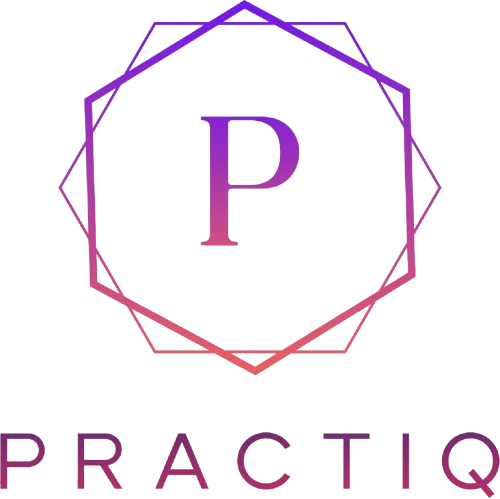

<div align="center">
  
  
  # Practiq — AI Mock Interview Coach

  **Practice smarter. Land faster.**
  
  An AI-powered mock interview platform built for placement season. Get role-specific, company-specific, and resume-based interview questions with real-time dual AI feedback from Groq and Google Gemini.

  
  
  
  
  

  [Live Demo](https://practiq.vercel.app) · [Report Bug](https://github.com/varshiniui/practiq/issues) · [LinkedIn](https://linkedin.com/in/varshini-shya)

</div>

---

## What is Practiq?

Practiq is a full-stack AI interview coaching platform that generates personalized interview questions based on your target company, role, and even your own resume. Unlike generic prep tools, every question is tailored — a Zomato Frontend interview feels different from a Google Frontend interview.

Built during placement season as a real tool to solve a real problem.

---

## Key Features

### Three Interview Modes

**Practice Mode**
Choose from 20+ roles across IT and non-IT domains. Get a curated set of questions with difficulty selection and timed sessions just like a real interview.

**Targeted Mode**
Select a company and a role to get AI-generated questions specific to that combination. Practicing for Razorpay as a Backend Engineer gives you fintech-flavored backend questions — not generic ones.

**Resume Mode**
Upload your resume as a PDF. The app extracts your projects, skills, and internships and generates 10 questions that only someone who actually built what's on your resume could answer.

### Dual AI Feedback
Every answer is evaluated independently by two AI models — Groq (LLaMA 3.3 70B) and Google Gemini 2.0 Flash — side by side. You get two perspectives: what was good, what was missed, and a better sample answer with scores out of 10.

### Hint System
Stuck on a question? Get up to 2 progressive hints per question. The first hint is a subtle nudge toward the right concept. The second is more direct. No answers given — just enough to get you thinking.

### Skip with Consequence
Skip up to 3 questions per session. Skipped questions are recorded with a score of 0, directly impacting your report card average — just like a real interview.

### Countdown Timer
Each question has a role-adjusted timer. HR and behavioral questions get 90 seconds. System design and AI/ML questions get 3 minutes. Timer turns orange at 30 seconds, red at 10, and auto-submits when it hits zero.

### Voice Input
Answer questions by speaking. Powered by Groq Whisper Large v3 for fast and accurate transcription directly in the browser.

### Report Card
After every session get a detailed report card showing your overall score, grade, per-question breakdown with insights, and a list of your recent sessions. Print or share your report card directly.

### Score History Dashboard
All sessions are saved to your account. The history page shows your score trend over time with a line chart, your best score, average score, and most practiced role.

### Infinite Rounds
Never run out of questions. After every 7 questions a new round begins with freshly generated questions — different concepts, different difficulty if you choose.

### Authentication
Email and password signup with Google OAuth via Supabase Auth. Each user's history is private and scoped to their account with row level security.

---

## Company Coverage

40+ companies across domains:

| Domain | Companies |
|--------|-----------|
| IT Services | TCS, Infosys, Wipro, Cognizant, Accenture, HCL, Capgemini, Mphasis, LTIMindtree |
| Product & Tech | Google, Microsoft, Amazon, Zoho, Freshworks, Chargebee, Kissflow |
| Fintech | Razorpay, PhonePe, Paytm, CRED |
| Food & Delivery | Swiggy, Zomato |
| Ecommerce | Flipkart, Myntra, Meesho |
| Edtech | Byju's, Unacademy, Scaler |
| Quick Commerce | Zepto, Blinkit, BigBasket |
| Mobility | Ola, Rapido, Namma Yatri |
| Consulting | Deloitte, EY, PwC |
| Government & Defence | ISRO, DRDO, HAL |

---

## Role Coverage

20+ roles across IT and non-IT:

**Technical** — Software Engineer, Frontend Developer, Backend Engineer, Full Stack Developer, Python Developer, AI/ML Engineer, DevOps Engineer, Cloud Engineer, QA Engineer, Flutter/Mobile Dev, Embedded Systems, Blockchain Developer, AR/VR Developer, Game Developer, Database Admin, Cybersecurity

**Non-Technical** — Business Analyst, Product Manager, UI/UX Designer, Data Analyst, Marketing Analyst, Financial Analyst, HR Executive, Operations Manager, Supply Chain Analyst, Content Strategist, Sales Engineer, Technical Writer, Scrum Master

---

## Tech Stack

| Layer | Technology |
|-------|-----------|
| Framework | Next.js 14 (App Router) |
| Styling | Tailwind CSS, Framer Motion |
| UI Components | shadcn/ui, lucide-react |
| AI — Text | Groq LLaMA 3.3 70B, Google Gemini 2.0 Flash |
| AI — Voice | Groq Whisper Large v3 |
| Auth | Supabase Auth (Email + Google OAuth) |
| Database | Supabase PostgreSQL |
| PDF Parsing | unpdf |
| Charts | Recharts |
| Deployment | Vercel |

---

## Getting Started

### Prerequisites

- Node.js 18+
- A Groq API key — [console.groq.com](https://console.groq.com)
- A Gemini API key — [aistudio.google.com](https://aistudio.google.com)
- A Supabase project — [supabase.com](https://supabase.com)

### Installation

```bash
git clone https://github.com/varshiniui/practiq.git
cd practiq
npm install
```

### Environment Variables

Create a `.env.local` file in the root:

```env
GROQ_API_KEY=your_groq_api_key
GEMINI_API_KEY=your_gemini_api_key
NEXT_PUBLIC_SUPABASE_URL=your_supabase_project_url
NEXT_PUBLIC_SUPABASE_ANON_KEY=your_supabase_anon_public_key
```

### Database Setup

Go to your Supabase project → SQL Editor and run the following:

```sql
-- Create the history table
create table public.practiq_history (
  id uuid default gen_random_uuid() primary key,
  user_id uuid references auth.users(id) on delete cascade,
  session_id text,
  date text,
  mode text,
  role text,
  company text,
  difficulty text,
  average_score numeric,
  total_questions integer,
  grade text,
  created_at timestamp with time zone default now()
);

-- Enable Row Level Security
alter table public.practiq_history enable row level security;

-- Allow users to insert their own records
create policy "Enable insert for authenticated users"
  on public.practiq_history
  for insert
  with check (auth.uid() = user_id);

-- Allow users to read only their own records
create policy "Enable select for authenticated users"
  on public.practiq_history
  for select
  using (auth.uid() = user_id);

-- Allow users to delete only their own records
create policy "Enable delete for authenticated users"
  on public.practiq_history
  for delete
  using (auth.uid() = user_id);
```

### Google OAuth Setup (Optional)

1. Go to [console.cloud.google.com](https://console.cloud.google.com) and create a project
2. Enable Google OAuth under APIs & Services → Credentials
3. Add your Supabase callback URL as an authorized redirect URI:
   `https://your-project-id.supabase.co/auth/v1/callback`
4. Copy the Client ID and Client Secret into Supabase → Authentication → Providers → Google

### Run Locally

```bash
npm run dev
```

Open [http://localhost:3000](http://localhost:3000)

---

## Project Structure

```
practiq/
├── app/
│   ├── page.tsx                  # Landing page
│   ├── auth/page.tsx             # Sign in / Sign up
│   ├── home/page.tsx             # Mode selector
│   ├── interview/page.tsx        # Interview session
│   ├── report/page.tsx           # Session report card
│   ├── history/page.tsx          # Score history dashboard
│   └── api/
│       ├── feedback/route.ts     # Dual AI feedback endpoint
│       ├── hint/route.ts         # Hint generation endpoint
│       ├── transcribe/route.ts   # Whisper transcription endpoint
│       ├── generate-questions/   # AI question generation
│       └── resume-interview/     # Resume PDF parsing + questions
├── components/
│   ├── AnswerInput.tsx           # Text + voice input toggle
│   ├── FeedbackCard.tsx          # Groq vs Gemini feedback display
│   ├── QuestionCard.tsx          # Question display with progress
│   ├── Timer.tsx                 # Countdown ring timer
│   ├── RoleSelector.tsx          # Role cards grid
│   └── CompanySelector.tsx       # Company cards with logos
├── lib/
│   ├── questions.ts              # Static question bank (20+ roles, 40+ companies)
│   ├── supabase.ts               # Supabase browser client
│   ├── groq.ts                   # Groq client
│   ├── gemini.ts                 # Gemini client
│   └── timerConfig.ts            # Role-based timer durations
└── public/
    └── practiq-logo.png
```

---

## API Routes

| Route | Method | Description |
|-------|--------|-------------|
| `/api/feedback` | POST | Takes question + answer, returns scored feedback from both Groq and Gemini |
| `/api/hint` | POST | Takes question + hint number, returns a progressive hint |
| `/api/transcribe` | POST | Takes audio file, returns transcribed text via Groq Whisper |
| `/api/generate-questions` | POST | Takes company + role + difficulty + round, generates 7 fresh questions |
| `/api/resume-interview` | POST | Takes PDF file, extracts text, generates 10 resume-specific questions |

---

## Deployment

### Deploy to Vercel

```bash
npm install -g vercel
vercel
```

Add all environment variables in Vercel dashboard → Project Settings → Environment Variables.

After deploying, update your Google OAuth authorized origins and redirect URIs to include your Vercel domain.

---

## Limitations

- Groq and Gemini free tiers have rate limits — the app handles failures gracefully with fallbacks
- Supabase free tier pauses projects after 7 days of inactivity — first request after a pause may take ~30 seconds
- Resume Mode works best with text-based PDFs — scanned image PDFs may not extract correctly
- Voice input requires microphone permission in the browser

---

## Built By

**Varshini** — 3rd year B.Tech Information Technology student at University College of Engineering Nagercoil (2023–2027)

[LinkedIn](https://linkedin.com/in/varshini-shya) · [GitHub](https://github.com/varshiniui) · [Portfolio](https://portfolio-one-rho-42.vercel.app)

---

<div align="center">
  <p>Built with Groq and Google Gemini. Made for placement season.</p>
</div>